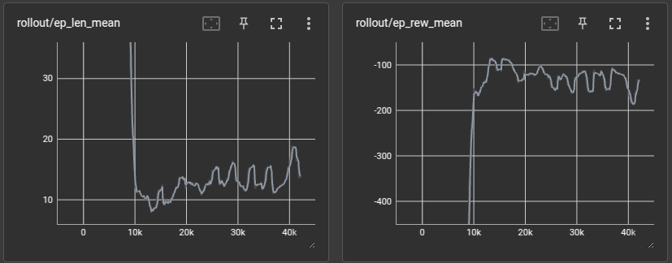
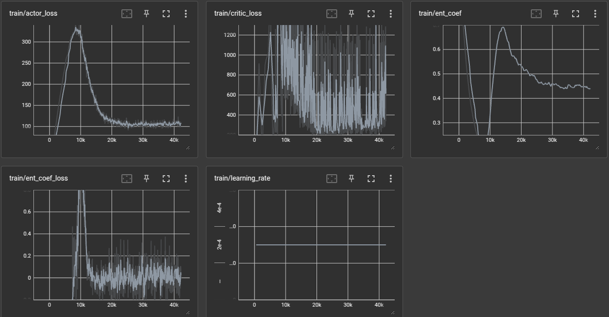

# reach3

The goal is to train a more precise agent for the *Reach* task. A penalisation for high velocity near the goal has been introduced, and logs that can be visualized with *tensorboard*:

    tensorboard --logdir=./logs

The graphs *ep_rew_mean*, *actor_loss* and *ent_coef* suggest that this model converged around 30000 iterations.

When tested using *test_gui.py*, the model has not shown significant improvements with regards to "staying in the goal point". For the next model, some adjustments have to be made. One idea is, instead of terminating the episode instantly when the end effector reaches the goal, force it to wait there until a counter gets to a threshold.